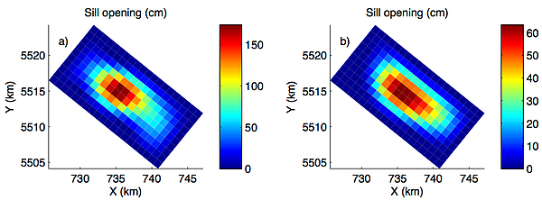

# **Mechanics of magma storage and transport**

How is magma stored and transported is a key volcanological question that help us to better understand how volcanoes work and whether episodes of unrest will end up in an eruption or not. The build up of stresses that produce surface ground deformation can eventually result in an eruption, but the conditions that will lead to it are highly dependent on the source geometry and the amount of intruded magma. Hence, it is paramount importance to be able to constrain these critical volcanic parameters. I study magma transport and storage by means of satellite geodesy using a combination of InSAR data, numerical and analytic inverse models to model both secular and transient ground deformation signals.  I have studied magma intrusion with InSAR data at several volcanoes in the Central and Southern Andes of Peru and Chile including Sabancaya, Ubinas, Lazufre volcanic complex, Peteroa, Quizapu, Nevados de Chillan, Copahue, Lonquimay, Llaima, Villarrica, Cordon Caulle, Calbuco, Chaiten and Hudson.

Mean surface velocities at Cordón Caulle volcano during 2012-2013 (a) and 2013-2015 (b). The ground displacement is most likely by magma intrusion following the VEI4 2011-2012 rhyodacitic eruption and decreased exponentially as predicted by simple models of magma recharge immediately after an eruption.

Distributed sill opening models for 2012-2013 (a) and 2013-2015 (b) at Cordon Caulle. The total volume change is 0.125 km3 in 3.25 years.  

### **Relevant publications**

[Viscoelastic relaxation: A mechanism to explain the decennial large surface displacements at the Laguna del Maule silicic volcanic complex](https://www.sciencedirect.com/science/article/pii/S0012821X19303383) 
Novoa, C., Remy, D., Gerbault, M., Baez, J.C., Tassara, A., Cordova, L., Cardona, C., Granger, M., Bonvalot, S., **Delgado, F.**  <i>Earth and Planetary Science Letters</i>. **2019**, 521, 46-59. doi:10.1016/j.epsl.2019.06.005

[Thoughts on the criteria to determine the origin of volcanic unrest as magmatic or non-magmatic](https://royalsocietypublishing.org/doi/10.1098/rsta.2018.0008) 
Pritchard, M.E., Mather, T.A., McNutt, S., **Delgado, F.**, Reath, K. <i>Philosophical Transactions of the Royal Society A: Mathematical, Physical and Engineering Sciences</i>. **2019**, 377, 2139, doi:10.1098/rsta.2018.0008.

[Thermal, deformation, and degassing remote sensing time series (A.D. 2000-2017) at the 47 most active volcanoes in Latin America: implications for volcanic systems](https://agupubs.onlinelibrary.wiley.com/doi/full/10.1029/2018JB016199) 
Reath, K., Pritchard  M., Poland, M., **Delgado, F.**, Carn, S., Coppola, D., Andrews, B., Ebemier, S., Rumpf, M.E., Henderson, S., Baker, S., Lundgren, P., Wright, R., Biggs, J., Lopez, T., Wauthier, C.,  Moruzzi, S., Alcott, A., Wessels, R., Griswold, J., Ogburn, S., Loughlin, S., Meyer, F., Vaughan, R., Bagnardi, M. <i>Journal of Geophysical Research</i>. **2019**, doi:10.1029/2018JB016199

[Renewed post-eruptive uplift following the 2011-2012 rhyolitic eruption of Cordón Caulle (Southern Andes, Chile): evidence for transient episodes of magma reservoir recharge during 2012-2018](https://agupubs.onlinelibrary.wiley.com/doi/abs/10.1029/2018JB016240) 
**Delgado, F.**, Pritchard, M., Samsonov, S., Córdova, L.. <i>Journal of Geophysical Research</i>. **2018**. doi:10.1029/2018JB016240

[Decelerating uplift at Lazufre volcanic center, Central Andes, from A.D. 2010 to 2016, and implications for geodetic models](https://pubs.geoscienceworld.org/gsa/geosphere/article/13/5/1489/353561/decelerating-uplift-at-lazufre-volcanic-center) 
Henderson, S., **Delgado, F.**, Pritchard, M., Elliott, J., Lundgren, P. <i>Geosphere</i>. **2017**, doi.org/10.1130/GES01441.1

[Recent unrest (2003-2015) imaged by space geodesy at the highest risk Chilean volcanoes:  Llaima, Villarrica and Calbuco (Southern Andes)](https://www.sciencedirect.com/science/article/pii/S0377027317303086) 
**Delgado, F.**, Pritchard, M.,  Ebmeier, S., Gonzalez, P., Lara, L. <i>Journal of Volcanology and Geothermal Research</i>. **2017**, doi:10.1016/j.jvolgeores.2017.05.020. Special issue of <i>"Volcano Geodesy: Recent developments and future challenges"</i>.

[Rapid uplift after the 2011-2012 Cordón Caulle (Southern Andes, Chile) rhyodacitic eruption: evidence for magma chamber refill](https://agupubs.onlinelibrary.wiley.com/doi/abs/10.1002/2016GL070066) 
**Delgado, F.**, Pritchard, M., Basualto, D., Lazo, J., Córdova, L., Lara, L. <i>Geophys. Res. Lett.</i>. **2016**, doi:10.1002/2016GL070066.

[The 2011 Cerro Hudson volcano eruption (Southern Andes, Chile):  Pre-eruptive inflation and hot spots observed with InSAR and thermal imagery](https://link.springer.com/article/10.1007/s00445-014-0815-9) 
**Delgado, F.**, Pritchard  M, Lohman  R, Naranjo,  J.A. <i>Bull. Volcanol.</i>. **2014**, Bull Volcanol, 76:815. doi:10.1007/s00445-014-0815-9.

# **Eruption Dynamics**

What triggers volcanic eruptions? This key and fundamental volcanological question has remained elusive because every volcano has its own dynamics thus precluding the development of general patterns. My research in the the volcanoes of the Southern Andes have shown that the VEI 4 2015 eruption of Calbuco volcano was less likely to triggered by a dike intrusion rather than either volatile exsolution or geodetically undetectable magma recharge. On the other hand, the VEI 1-2 2008-2009 Llaima  and 2015 Villarrica eruptions were too small to produce a signal to be detected by geodetic methods, in agreement with the dynamics of open vent volcanoes. Eruptions in this type of volcanoes are likely to be triggered by small perturbations in their plumbing systems.

Calbuco Sentinel-1 interferograms showing ground deformation from the April 22–23, 2015 eruptions (g, j), model predictions for a spheroidal pressurized source (h, k) and residuals (i, l). The purple square circle shows the location of the OVDAS tilt meter, the only geodetic instrument during the eruption. The red circle shows the location of the best-fit sources. InSAR data can be explained by a pressurized source, with no evidence for a dike intrusion. The lack of pre-eruptive unrest suggest that the eruption was likely triggered by second boiling gas exsolution. The large residuals suggest that the source is more complex than a pressurized spheroid.

 

Cordon Caulle effusive phase ENVISAT IS6 interferograms showing ground deformation (left column), model predictions (middle column) for a finite element horizontal spheroid and residuals (right column). The blue triangle and red polygon are the 2011-2012 eruptive vent and lava flow. The green circle and black lines are the spheroid centroid and semi axes. The spheroid is elongated in the direction of the volcanic chain, which suggest a tectonic control in the eruption. The higher residual in the interferogram recorded during the waning of the eruption indicate a change in the deformation source, which is coeval with an increase in the long period seismicity and a renewed pulse of lava extrusion which increased the lava time averaged discharge rate. 

### **Relevant publications**

[Physicochemical models of effusive rhyolitic eruptions constrained with InSAR and DEM data: a case study of the 2011-2012 Cordon Caulle eruption](https://www.sciencedirect.com/journal/earth-and-planetary-science-letters) 
**Delgado, F.**, Kubanek, J., Anderson, K., Lundgren, P., Pritchard, M. <i>Earth and Planetary Science Letters</i>. **2019**, in press

[Thermal, deformation, and degassing remote sensing time series (A.D. 2000-2017) at the 47 most active volcanoes in Latin America: implications for volcanic systems](https://agupubs.onlinelibrary.wiley.com/doi/full/10.1029/2018JB016199) 
Reath, K., Pritchard  M., Poland, M., **Delgado, F.**, Carn, S., Coppola, D., Andrews, B., Ebemier, S., Rumpf, M.E., Henderson, S., Baker, S., Lundgren, P., Wright, R., Biggs, J., Lopez, T., Wauthier, C.,  Moruzzi, S., Alcott, A., Wessels, R., Griswold, J., Ogburn, S., Loughlin, S., Meyer, F., Vaughan, R., Bagnardi, M. <i>Journal of Geophysical Research</i>. **2019**, doi:10.1029/2018JB016199
This aerticle has been highlighted in the Research Spotlight section of the AGU EOS journal 

[Recent unrest (2003-2015) imaged by space geodesy at the highest risk Chilean volcanoes:  Llaima, Villarrica and Calbuco (Southern Andes)](https://www.sciencedirect.com/science/article/pii/S0377027317303086) 
**Delgado, F.**, Pritchard, M.,  Ebmeier, S., Gonzalez, P., Lara, L. <i>Journal of Volcanology and Geothermal Research</i>. **2017**, doi:10.1016/j.jvolgeores.2017.05.020. Special issue of <i>"Volcano Geodesy: Recent developments and future challenges"</i>.

# **Physics-based models of silica-rich effusive eruptions**

Geodetic and extruded volume data sets acquired at both silicic and basaltic volcanoes show quasi-exponential trends that are indicative of coupled conduit flow and magma reservoir pressure drop. I am developing a numerical model that couples the magma extrusion, magma reservoir deflation and including time-dependent gas exsolution and viscosity for the effusive phase of the 2011-2012 rhyodacitic eruption of Cordon Caulle volcano. The major goal is to predict the temporal evolution of one of these rare but powerful and dangerous eruptions, and to provide insights on the magma properties (dissolved and exsolved water, viscosity, crystal content) from geodetic and topographic data only. The latter is a key advance because the vast majority of the models used by volcano geodesists do not provide insights on the magma physical properties, which are key parameters that control the erupted volume, eruption duration, and transitions between effusive and explosive eruptions.

Numerical simulation of a physics-based model with variable amounts of complexity (constant magma properties, constant magma properties with the effect of an increasing load due to lava extrusion over the magma reservoir and time dependent magma properties) compared with the pressure drop of a spheroidal magma reservoir inverted from InSAR data and the total extruded volume calculated from a set of TanDEM-X digital elevation models. The model parameters are the pressure drop, total water content and percetange of crystals in the eruptible magma.

### **Relevant publications**

[Physicochemical models of effusive rhyolitic eruptions constrained with InSAR and DEM data: a case study of the 2011-2012 Cordon Caulle eruption](https://www.sciencedirect.com/journal/earth-and-planetary-science-letters) 
**Delgado, F.**, Kubanek, J., Anderson, K., Lundgren, P., Pritchard, M. <i>Earth and Planetary Science Letters</i>. **2019**, in press

# **InSAR geodesy**

InSAR (Interferometric Synthetic Aperture Radar) has revolutionized volcanology providing dense geodetic observations (up to ~0.5 m/pixel, most likely 10-30 m/pixel), albeit with a poor temporal sampling (1-42 days depending on the SAR platform). One of the major limitations of the method is the presence of atmospheric signals produced by water vapor and pressure changes that are correlated with the topography. In the case of stratovolcanoes, these signals mimic ground deformation produced by magma reservoir pressurization, and can be very challenging to mitigate for the time scales of volcanic eruptions (0.01 - 10 days). I'm interested in developing and comparing approaches that can reduce the effect of these artifacts.

On the other hand, volcano deformation is recorded over spatial scales that vary between a few tens of meters to hundreds of kilometers, produced by conduit pressurisation or very shallow sources to lower crustal intrusions. Ice covered volcanoes such as those in the Southern Andes are likely to pressurise only near the volcano summit, in areas where instrument deployments are very difficult due to harsh environmental conditions. These signals require specific acquisition plans to be potentially detectable by InSAR, hence I am also interested on using the complete civilian SAR constellation (TerraSAR-X/TanDEM-X, COSMO-SkyMED, RADARSAT-2, Sentinel-1A/B and ALOS-2) and the unique characteristics of each satellite to better understand volcanic processes over a wide range of spatio-temporal scales.  

Examples of 1-day CSK (COSMO-SkyMED) and 2-days UAVSAR interferograms at Villarrica volcano. The labels show the season, repeat period and acquisition dates. All the interferograms are wrapped and only a and b are filtered. Dashed black lines are the swaths of TerraSAR-X spotlight data. The figure shows that with the current SAR platforms it is not possile to sustain coherence in the summit of heavily glaciated but restless volcanoes. Only UAVSAR data is coherent but this platform is not used for permanent overflights. This currently hampers the use of InSAR to study of conduit pressurization produced by either stick-slip of solid plugs of andesitic magma or by gas slugs during strombolian eruptions because these signals are likely to be detected only with measurement acquired less than a few hundred meters from the eruptive vents.

Comparison of methods to correct atmospheric phase delays in ALOS-1 and CSK interferograms at Llaima (a-b only) and Villarrica volcanoes for ALOS-1 (a-b) and COSMO-SkyMED (c). The analysis shows that low-resolution global atmospheric models such as ERA-I do not significantly reduce the atmospheric noise variance compared with simple empirical techniques like a ramp with an elevation dependent term. This significantly hampers the detection of small-amplitude, transient signals in stratovolcanoes that are correlated with the spatial wavelengths of topography correlated atmospheric noise.

Coherence comparison for interferograms with 24 and 48 day repeat periods at Cordon Caulle volcano. The data sets are a low resolution wide swath mode (Sentinel-1 Terrain Observation by Progressive Scans, 20 m/pixel) with VV polarization and a high resolution strip map beam (RADARSAT-2 Wide Ultra Fine 12, 2 m/pixel) with HH polarization. The RADARSAT-2 coherence ​is much higher than the Sentinel-1 coherence due to a combination of the higher resolution and the HH polarization. 

### **Relevant publications**

[Towards coordinated regional multi-satellite InSAR volcano observations: Results from the Latin America pilot project](https://link.springer.com/article/10.1186/s13617-018-0074-0) 
Pritchard, M.E., Biggs, J., Wauthier, C., Sansosti, E., Arnold, D.W.D., **Delgado, F.**, Ebmeier, S.K., Henderson, S.T., Stephens, K., Cooper, C., Wnuk, K., Amelung, F., Aguilar, V., Mothes, P., Macedo, O., Lara, L.E., Poland, M.P., Zoffoli, S. <i>Journal of Applied Volcanology</i>. **2018**, 7:5, doi.org/10.1186/s13617-018-0074-0
 
[Recent unrest (2003-2015) imaged by space geodesy at the highest risk Chilean volcanoes:  Llaima, Villarrica and Calbuco (Southern Andes)](https://www.sciencedirect.com/science/article/pii/S0377027317303086) 
**Delgado, F.**, Pritchard, M.,  Ebmeier, S., Gonzalez, P., Lara, L. <i>Journal of Volcanology and Geothermal Research</i>. **2017**, doi:10.1016/j.jvolgeores.2017.05.020. Special issue of <i>"Volcano Geodesy: Recent developments and future challenges"</i>.

# **Crustal deformation and volcano-tectonic interactions**

I am also interested in the use of InSAR to study active crustal deformation produced by both tectonic and volcano-tectonic processes. Geodetic data can provides critical information not available by  point source seismic inversions like the complexity of fault slip in the Earth's surface, evidence for complex rupture geometries and the role of magmatic fluids in aseismic deformation. 

 
Left. TerraSAR-X interferogram of the July 17 2013 Mw 5.8 earthquake NW of Sabancaya volcano (black triangle) in Southern Peru. InSAR shows that the earthquake is of tectonic origin, a curved normal fault with a strike slip component. These details, like the non-planar fault, cannot be inferred by point source models such as those calculated by global earthquake networks like from USGS or GCMT, highlighting the value of having high spatial resolution measurements of ground deformation. The geodetic focal mechanism is in agreement with the seismic moment tensor for both the geometry and the seismic moment, and shows that there is no evidence for either volcano-induced deformation or magma injection. The interferogram also shows triggered slip on smaller faults N of Sabancaya, as well as residual atmospheric noise.

Unwrapped (middle) and wrapped (right) 2013/11 - 2016/12 TerraSAR-X mean velocity calculated from InSAR time series that show ~4-5 cm of uplift produced by a deep inflating source beneath Hualca Hualca volcano. The inflation likely triggers aseismic afterslip in the fault responsible for the July 2013 Mw 5.9 earthquake, which is better observed in the wrapped interferogram.

 
 

ALOS interferograms of the 2007 Aysen seismic swarm in Southern Chile. Despite the strong geological and seismological evidence that the swarm occurred in a branch of the regional NS right-lateral Liquiñe-Ofqui fault zone, the displacements recorded in InSAR data can only be explained by an EW left-lateral strike slip fault,
 
### **Relevant publications**

[Deformation and seismicity near Sabancaya volcano, southern Peru, from 2002 to 2015](http://onlinelibrary.wiley.com/doi/10.1002/2015GL063589/full) 
Jay, J.A., **Delgado, F.J.**, Torres,  J.L., Pritchard, M.E.,  Macedo,  O., Aguilar , V. <i>Geophys. Res. Lett.</i>. **2015**, 42, 2780–2788. doi: 10.1002/2015GL063589.

