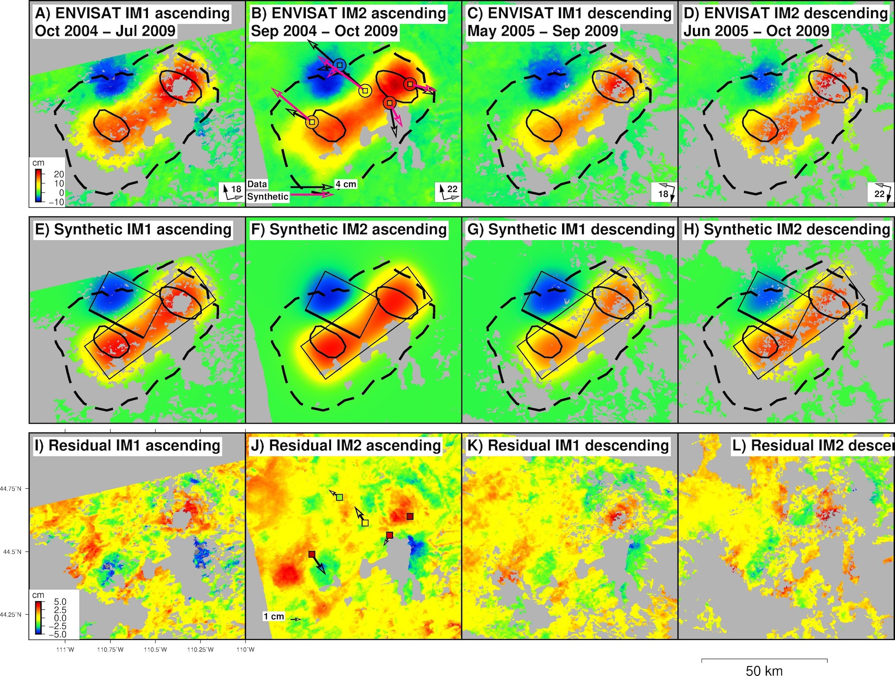
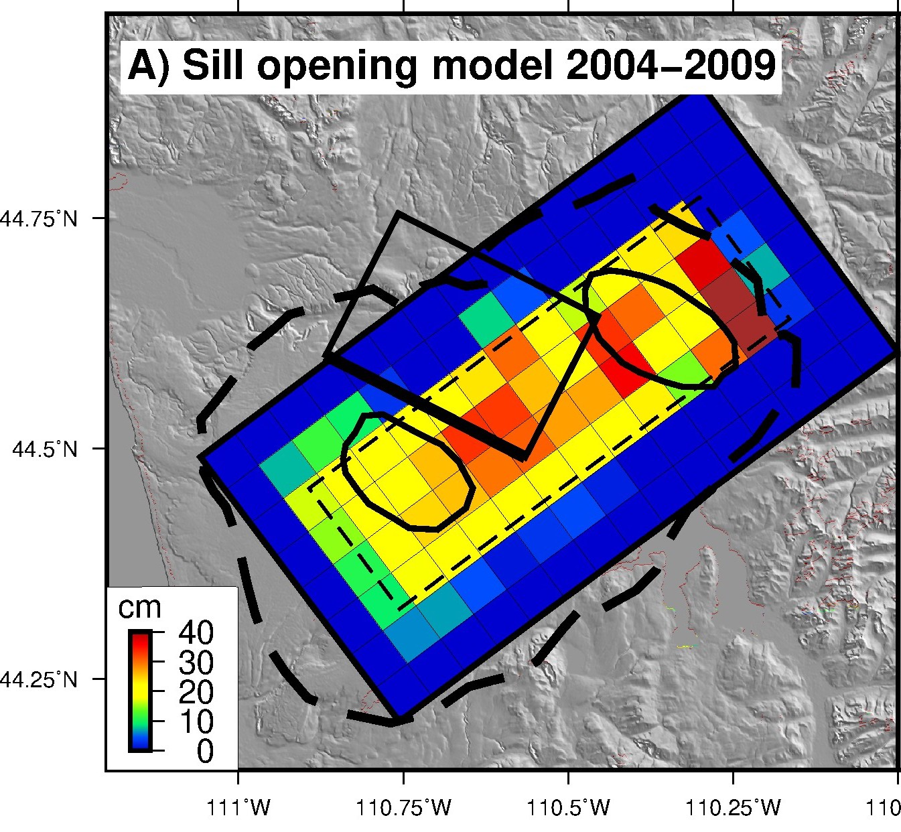

# **Volcanology**

## **Mechanics of magma storage and transport**

The migration and storage of magma in the upper crust results in stress build up that can eventually lead in an eruption.  However, the conditions that lead to eruptions are highly dependent on the volcano evolution, source geometry, the amount of intruded magma, the presence of fluids that can easily be remobilized in a crystal mush, and rheological state among other parameters. The stress changes can be tracked with ground deformation data, and I use these observations to study magma transport and storage by means of satellite geodesy using a combination of InSAR data, numerical and analytic inverse models.  <!--I have studied magma intrusion with InSAR data at several volcanoes in the Central and Southern Andes including the famous Villarrica, Cordon Caulle, Calbuco, Chaiten, and at Yellowstone caldera. 
-->

Episode of unrest at Aniakchak Crater in Alaska during early 2023, with a LOS uplift of 72 cm. SAOCOM-1 stripmap descending interferogram spanning 4 months of the episode of unrest (A), ALOS-2 ScanSAR ascending interferogram spanning the same episode (B), wrapped unfiltered Sentinel-1 winter interferogram (C), cumulative displacement between June and September 2023 from Sentinel-1 time series (D), time series (E) for SAOCOM-1 (orange dots) and Sentinel-1A data (black squares). This is the fastest deformation event I have detected ever with InSAR ([Delgado et al., 2024.](https://ieeexplore.ieee.org/document/10586971)) .

Time series of uplift at Cordon Caulle volcano measured by Sentinel-1, COSMO-SkyMED, RADARSAT-2, ALOS-2 and SAOCOM-1 ascending (asc) and descending (dsc) data after its 2011-2012 eruption (vertical black dashed line).  Updated from Figure 5 in [Delgado, 2020.](https://www.sciencedirect.com/science/article/abs/pii/S0895981120303849)  The black dots show the horizontal baseline change between two GPS stations in the volcano. The black line shows an exponential fit to the COSMO-SkyMED data during 2012-2015 and is strong evidence for a mechanism of magma injection in a shallow pressurized reservoir. Magma injection is likely responsible for the four pulses of ground uplift, although other mechanisms like viscoelastic relaxation and poroelastic mush extraction can also explain the deformation signals ([Delgado et al., 2018](https://agupubs.onlinelibrary.wiley.com/doi/abs/10.1029/2018JB016240); [Phelps et al., 2023](https://academic.oup.com/gji/article/235/1/610/7209152)).

Laguna de Maule geodetic data. ALOS and SAOCOM-1 ascending interferograms converted to mean ground velocity dividing by their time span. Triangles are GNSS stations from OVDAS. Time series of ground deformation from ALOS ([Le Mevel et al., 2021](https://link.springer.com/article/10.1007/s00445-021-01457-0)), ENVISAT IM6 data and from the MAU2 GNSS station (black triangle in the SAOCOM-1 interferogram). The GNSS data were processed with the PPP-AR algorithm with the Bernese software by Centro Sismológico Nacional, Universidad de Chile. All the InSAR data can be easily processed with the stripmapApp.py and stripmap stack processor modules of the ISCE software.

<!--

A-D) Interferograms calculated from ENVISAT time series showing deformation due to Yellowstone caldera uplift during 2004-2009, E-H) Synthetic interfeorgrams produced by the best-fit two horizontal dislocations (black rectangles) and I-L) difference between data and synthetics. Arrows in B) show GPS data and synthetic data.

Distributed sill opening model for 2004-2009 for Yellowstone caldera. The total volume change is 0.3 km3 in 5 years [(Delgado and Grandin, 2021).](https://agupubs.onlinelibrary.wiley.com/doi/10.1029/2021JB022341) 
-->

### **Relevant publications**

[A global assessment of SAOCOM-1 L-band stripmap data for InSAR characterization of volcanic, tectonic, cryospheric, and anthropogenic deformation.](https://ieeexplore.ieee.org/document/10586971) 
**Delgado, F.**, Shreve, T., Borgstrom, S., León-Ibañez, P., Castillo, J., Poland, M., **2024** IEEE Transactions on Geoscience and Remote Sensing, doi:10.1109/TGRS.2024.3423792.

[First onset of unrest captured geodetically at Socompa Volcano, Northern Chile.](https://agupubs.onlinelibrary.wiley.com/journal/19448007) 
Liu, F., Elliott, J. R., Ebmeier, S. K., Craig, T. J., Hooper, A., Novoa Lizama, C., **Delgado, F.**. Geophysical Research Letters, **2023**, doi: 10.1029/2022GL102480.

[Dynamics of episodic magma injection and migration at Yellowstone caldera: revisiting the 2004-2009 episode of  caldera uplift with InSAR and GPS.](https://doi.org/10.1029/2021JB022341) 
**Delgado, F.**, Grandin, R., 2021. Journal of Geophysical Research: Solid Earth, 126, e2021JB022341. https://doi.org/10.1029/2021JB022341.

[Rhyolitic volcano dynamics in the Southern Andes: contributions from 17 years of InSAR observations at Cordon Caulle since 2003 to 2020.](https://www.sciencedirect.com/science/article/abs/pii/S0895981120303849) 
**Delgado, F.**.  <i>Journal of South American Earth Sciences </i>, special issue on <i>New advances on SAR Interferometry in South America</i>. **2020**, doi:10.1016/j.jsames.2020.102841

[Volcano-tectonic interactions at Sabancaya volcano, Peru: eruptions, magmatic inflation, moderate earthquakes, and fault creep](https://agupubs.onlinelibrary.wiley.com/doi/abs/10.1029/2019JB019281) 
MacQueen, P., **Delgado, F.**, Reath, K., Pritchard, M., Lundgren, P., Milillo, P., Bagnardi, M., Macedo, O., Aguilar, V., Lazarte, I.,  Machacca, R., Miranda, R., 2020.  <i>Journal of Geophysical Research</i>, doi.org/10.1029/2019JB019281. Special issue on "Creep on continental faults and subduction zones: Geophysics, geology, and mechanics", in press.

[Viscoelastic relaxation: A mechanism to explain the decennial large surface displacements at the Laguna del Maule silicic volcanic complex](https://www.sciencedirect.com/science/article/pii/S0012821X19303383) 
Novoa, C., Remy, D., Gerbault, M., Baez, J.C., Tassara, A., Cordova, L., Cardona, C., Granger, M., Bonvalot, S., **Delgado, F.**  <i>Earth and Planetary Science Letters</i>. **2019**, 521, 46-59. doi:10.1016/j.epsl.2019.06.005

[Thoughts on the criteria to determine the origin of volcanic unrest as magmatic or non-magmatic](https://royalsocietypublishing.org/doi/10.1098/rsta.2018.0008) 
Pritchard, M.E., Mather, T.A., McNutt, S., **Delgado, F.**, Reath, K. <i>Philosophical Transactions of the Royal Society A: Mathematical, Physical and Engineering Sciences</i>. **2019**, 377, 2139, doi:10.1098/rsta.2018.0008.

[Thermal, deformation, and degassing remote sensing time series (A.D. 2000-2017) at the 47 most active volcanoes in Latin America: implications for volcanic systems](https://agupubs.onlinelibrary.wiley.com/doi/full/10.1029/2018JB016199) 
Reath, K., Pritchard  M., Poland, M., **Delgado, F.**, Carn, S., Coppola, D., Andrews, B., Ebemier, S., Rumpf, M.E., Henderson, S., Baker, S., Lundgren, P., Wright, R., Biggs, J., Lopez, T., Wauthier, C.,  Moruzzi, S., Alcott, A., Wessels, R., Griswold, J., Ogburn, S., Loughlin, S., Meyer, F., Vaughan, R., Bagnardi, M. <i>Journal of Geophysical Research</i>. **2019**, doi:10.1029/2018JB016199

[Renewed post-eruptive uplift following the 2011-2012 rhyolitic eruption of Cordón Caulle (Southern Andes, Chile): evidence for transient episodes of magma reservoir recharge during 2012-2018](https://agupubs.onlinelibrary.wiley.com/doi/abs/10.1029/2018JB016240) 
**Delgado, F.**, Pritchard, M., Samsonov, S., Córdova, L.. <i>Journal of Geophysical Research</i>. **2018**. doi:10.1029/2018JB016240

[Decelerating uplift at Lazufre volcanic center, Central Andes, from A.D. 2010 to 2016, and implications for geodetic models](https://pubs.geoscienceworld.org/gsa/geosphere/article/13/5/1489/353561/decelerating-uplift-at-lazufre-volcanic-center) 
Henderson, S., **Delgado, F.**, Pritchard, M., Elliott, J., Lundgren, P. <i>Geosphere</i>. **2017**, doi.org/10.1130/GES01441.1

[Recent unrest (2003-2015) imaged by space geodesy at the highest risk Chilean volcanoes:  Llaima, Villarrica and Calbuco (Southern Andes)](https://www.sciencedirect.com/science/article/pii/S0377027317303086) 
**Delgado, F.**, Pritchard, M.,  Ebmeier, S., Gonzalez, P., Lara, L. <i>Journal of Volcanology and Geothermal Research</i>. **2017**, doi:10.1016/j.jvolgeores.2017.05.020. Special issue of <i>"Volcano Geodesy: Recent developments and future challenges"</i>.

[Rapid uplift after the 2011-2012 Cordón Caulle (Southern Andes, Chile) rhyodacitic eruption: evidence for magma chamber refill](https://agupubs.onlinelibrary.wiley.com/doi/abs/10.1002/2016GL070066) 
**Delgado, F.**, Pritchard, M., Basualto, D., Lazo, J., Córdova, L., Lara, L. <i>Geophys. Res. Lett.</i>. **2016**, doi:10.1002/2016GL070066.

[The 2011 Cerro Hudson volcano eruption (Southern Andes, Chile):  Pre-eruptive inflation and hot spots observed with InSAR and thermal imagery](https://link.springer.com/article/10.1007/s00445-014-0815-9) 
**Delgado, F.**, Pritchard  M, Lohman  R, Naranjo,  J.A. <i>Bull. Volcanol.</i>. **2014**, Bull Volcanol, 76:815. doi:10.1007/s00445-014-0815-9.

## **Eruption Dynamics**

What triggers volcanic eruptions? This key and fundamental volcanological question has remained elusive because every volcano has its own dynamics thus precluding the development of general patterns. My research in the the volcanoes of the Southern Andes have shown that the VEI 4 2015 eruption of Calbuco volcano was less likely to triggered by a dike intrusion rather than either volatile exsolution or geodetically undetectable magma recharge. On the other hand, the VEI 1-2 2008-2009 Llaima  and 2015 Villarrica eruptions were too small to produce a signal to be detected by geodetic methods, in agreement with the dynamics of open vent volcanoes. Eruptions in this type of volcanoes are likely to be triggered by small perturbations in their plumbing systems.

<!--

Calbuco Sentinel-1 interferograms showing ground deformation from the April 22–23, 2015 eruptions (g, j), model predictions for a spheroidal pressurized source (h, k) and residuals (i, l). The purple square circle shows the location of the OVDAS tilt meter, the only geodetic instrument during the eruption. The red circle shows the location of the best-fit sources. InSAR data can be explained by a pressurized source, with no evidence for a dike intrusion. The lack of pre-eruptive unrest suggest that the eruption was likely triggered by second boiling gas exsolution. The large residuals suggest that the source is more complex than a pressurized spheroid.

 

Cordon Caulle effusive phase ENVISAT IS6 interferograms showing ground deformation (left column), model predictions (middle column) for a finite element horizontal spheroid and residuals (right column). The blue triangle and red polygon are the 2011-2012 eruptive vent and lava flow. The green circle and black lines are the spheroid centroid and semi axes. The spheroid is elongated in the direction of the volcanic chain, which suggest a tectonic control in the eruption. The higher residual in the interferogram recorded during the waning of the eruption indicate a change in the deformation source, which is coeval with an increase in the long period seismicity and a renewed pulse of lava extrusion which increased the lava time averaged discharge rate. 
-->

 

Different geodetic data (interferograms, range offsets, cumulative displacement from InSAR time series) from different missions (ALOS-2, COSMO-SkyMed, Sentinel-1, left column),  predictions of the best-fit Okada sill (black rectangle) and residuals (right column) spanning the 2-month 2018 Sierra Negra eruption ([Shreve and Delgado, 2023](https://agupubs.onlinelibrary.wiley.com/doi/10.1029/2023JB026437?af=R)). The dots are hypocenters from a local seismic network ([Bell et al., 2021](https://www.nature.com/articles/s41467-021-21596-4)).

### **Relevant publications**

[Trapdoor fault activation: a step towards caldera collapse at Sierra Negra, Galápagos, Ecuador.](https://agupubs.onlinelibrary.wiley.com/doi/10.1029/2023JB026437?af=R) 
Shreve, T., **Delgado, F.**. Journal of Geophysical Research, **2023**, 128, e2023JB026437, doi:10.1029/2023JB026437.

[Magma buoyancy drives rhyolitic eruptions: a tale from the VEI 5 2008-2009 Chaitén eruption from seismological and geodetic data.](https://authors.elsevier.com/a/1f3mq_,1tQ2ki8) 
**Delgado, F.**, Contreras-Arratia, R., Samsonov, S. <i>Earth and Planetary Science Letters</i>, 590, 117564, **2022**, doi:10.1016/j.epsl.2022.117564

[From major caldera subsidence to quiescence at the world’s top volcanic degassing source, Ambrym, Vanuatu: the influence of regional tectonics](https://www.nature.com/articles/s41598-019-55141-7/) 
Shreve, T., Grandin, R., Boichu, M., Garaebiti, E., Moussallam, Y., Ballu, V., **Delgado, F.**, Leclerc, F., Henriot, N., Cevuard, S., Tari, D., Lebellegard, P., Pelletier, B. <i>Scientific Reports</i>. **2019**, 9, 18868, doi.org/10.1038/s41598-019-55141-7

[Physicochemical models of effusive rhyolitic eruptions constrained with InSAR and DEM data: a case study of the 2011-2012 Cordon Caulle eruption](https://www.sciencedirect.com/science/article/pii/S0012821X19304285) 
**Delgado, F.**, Kubanek, J., Anderson, K., Lundgren, P., Pritchard, M. <i>Earth and Planetary Science Letters</i>. **2019**, 524, doi:10.1016/j.epsl.2019.115736

[Thermal, deformation, and degassing remote sensing time series (A.D. 2000-2017) at the 47 most active volcanoes in Latin America: implications for volcanic systems](https://agupubs.onlinelibrary.wiley.com/doi/full/10.1029/2018JB016199) 
Reath, K., Pritchard  M., Poland, M., **Delgado, F.**, Carn, S., Coppola, D., Andrews, B., Ebemier, S., Rumpf, M.E., Henderson, S., Baker, S., Lundgren, P., Wright, R., Biggs, J., Lopez, T., Wauthier, C.,  Moruzzi, S., Alcott, A., Wessels, R., Griswold, J., Ogburn, S., Loughlin, S., Meyer, F., Vaughan, R., Bagnardi, M. <i>Journal of Geophysical Research</i>. **2019**, doi:10.1029/2018JB016199
This aerticle has been highlighted in the Research Spotlight section of the AGU EOS journal 

[Recent unrest (2003-2015) imaged by space geodesy at the highest risk Chilean volcanoes:  Llaima, Villarrica and Calbuco (Southern Andes)](https://www.sciencedirect.com/science/article/pii/S0377027317303086) 
**Delgado, F.**, Pritchard, M.,  Ebmeier, S., Gonzalez, P., Lara, L. <i>Journal of Volcanology and Geothermal Research</i>. **2017**, doi:10.1016/j.jvolgeores.2017.05.020. Special issue of <i>"Volcano Geodesy: Recent developments and future challenges"</i>.

## **Volcano Topography**

Satellite data from either InSAR missions (TanDEM-X, SRTM) or optical (Pléiades) can be used to construct high resolution DEMs (2 - 10 m/pixel). These data sets provide insights on the extrusion rates of both lava flows and domes, and changes in the glacier that cover many volcanoes. 

Differential DEMs betwwen a TanDEM-X CoSSC and the 12 m TanDEM-X DEM, and between the 12 m TanDEM-X DEM and the 2000 SRTM DEM spanning the 2005 and 2018 eruptions of Sierra Negra caldera ([Shreve and Delgado, 2023](https://agupubs.onlinelibrary.wiley.com/doi/10.1029/2023JB026437?af=R); [Galetto et al., 2024](https://www.jvolcanica.org/ojs/index.php/volcanica/article/view/245/)).

Pléiades 2 m shaded relief DEM that shows multiple lava flows and domes in the Cordon Caulle graben ([Delgado et al., 2019](https://www.sciencedirect.com/science/article/pii/S0012821X19304285)).

Differential DEMs between TanDEM-X and SRTM (a), TanDEM-X and Pléiades (b), and SRTM and Pléiades (c) of Hudson caldera. The extreme ice thinning is due to a combination of both global warming and a potential high heat flux due to magma injection in the volcano ([Galetto et al., 2024](https://www.jvolcanica.org/ojs/index.php/volcanica/article/view/245/)). 

### **Relevant publications**

[The utility of TerraSAR-X, TanDEM-X, and PAZ for studying global volcanic activity: Successes, challenges, and future prospects.](https://www.jvolcanica.org/ojs/index.php/volcanica/article/view/245/) 
Galetto, F., Dualeh, E., **Delgado, F.**, Pritchard, M., Poland, M., Ebmeier, S., Shreve, T., Biggs, J., Hamling, I., Wauthier, C., Gonzalez Santana, J., Froger, J.-L., Bemelmans, M. Volcanica, **2024**, 7(1), 273–301. doi: 10.30909/vol.07.01.273301.

[Trapdoor fault activation: a step towards caldera collapse at Sierra Negra, Galápagos, Ecuador.](https://agupubs.onlinelibrary.wiley.com/doi/10.1029/2023JB026437?af=R) 
Shreve, T., **Delgado, F.**. Journal of Geophysical Research, **2023**, 128, e2023JB026437, doi:10.1029/2023JB026437.

[Magma buoyancy drives rhyolitic eruptions: a tale from the VEI 5 2008-2009 Chaitén eruption from seismological and geodetic data.](https://authors.elsevier.com/a/1f3mq_,1tQ2ki8) 
**Delgado, F.**, Contreras-Arratia, R., Samsonov, S. <i>Earth and Planetary Science Letters</i>, 590, 117564, **2022**, doi:10.1016/j.epsl.2022.117564

[Physicochemical models of effusive rhyolitic eruptions constrained with InSAR and DEM data: a case study of the 2011-2012 Cordon Caulle eruption](https://www.sciencedirect.com/science/article/pii/S0012821X19304285) 
**Delgado, F.**, Kubanek, J., Anderson, K., Lundgren, P., Pritchard, M. <i>Earth and Planetary Science Letters</i>. **2019**, 524, doi:10.1016/j.epsl.2019.115736

